# Geospatial-Map-Gallery
*By Dustin Littlefield*

Welcome to my portfolio of cartographic and geospatial analysis projects. This collection showcases thematic maps, spatial modeling, and data visualizations built using GIS tools and remote sensing techniques.

I recently graduated **summa cum laude** with a B.S. in Data Science and a Certificate in GIS from **Arizona State University**, and I am transitioning from a 15-year career as a medical lab technician to the geospatial field. 

---

## About This Portfolio

This repository contains a curated set of maps created for coursework, capstone projects, and independent study. The maps demonstrate:

- Spatial data visualization
- Cartographic design principles
- Environmental and urban planning analysis
- Interpolation and terrain modeling
- Public health and transportation applications

---

## Map Categories

### Forestry and Land Use

- **Douglas Fir Distribution – Linn County, Oregon**  
  Binary raster map showing presence of Douglas Fir forests with inset illustrations for visual context.
  
 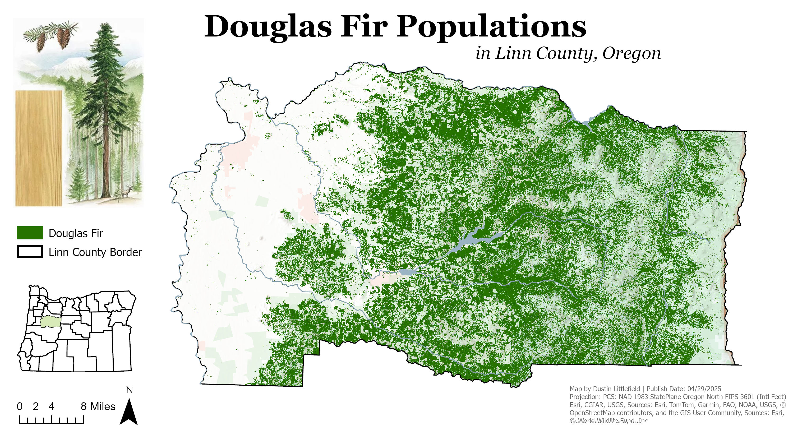
  
- **Linn County Waterways – Oregon Hydrology Map**  
  Detailed reference map of streams and rivers using high-resolution hydrography data.
  
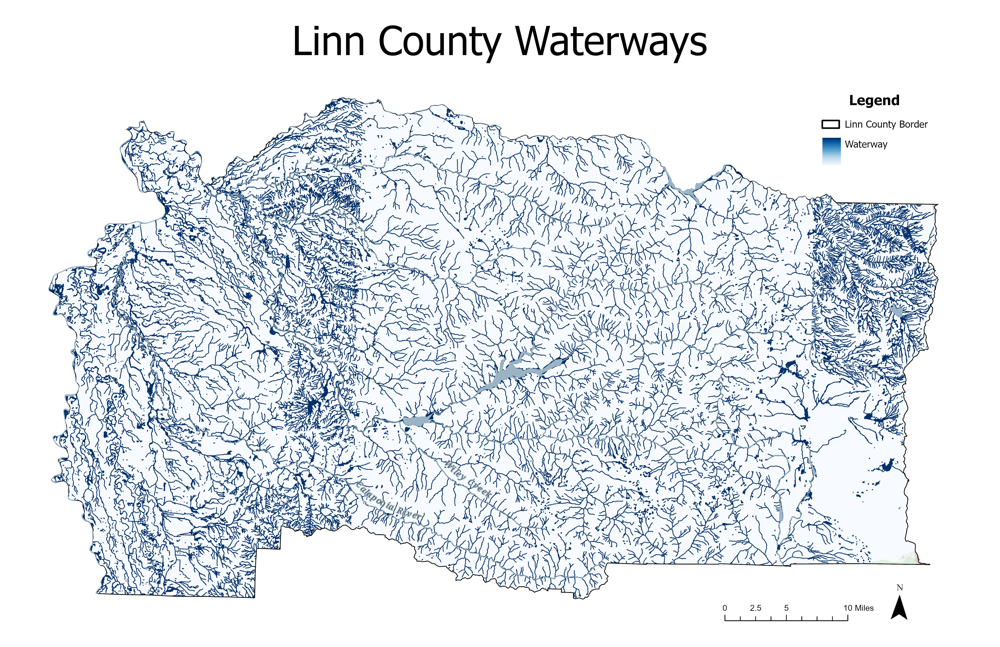

- **Pumpkin Creek Watershed Analysis – Oklahoma**  
  Multi-panel map showing slope, flow direction, stream order, and delineated sub-basins derived from DEMs.
  

- **Timber Harvest Suitability – Slope, Ownership, Distance to Roads**  
  Map layers used in a weighted overlay model for identifying suitable timber harvesting zones in Linn County.
  
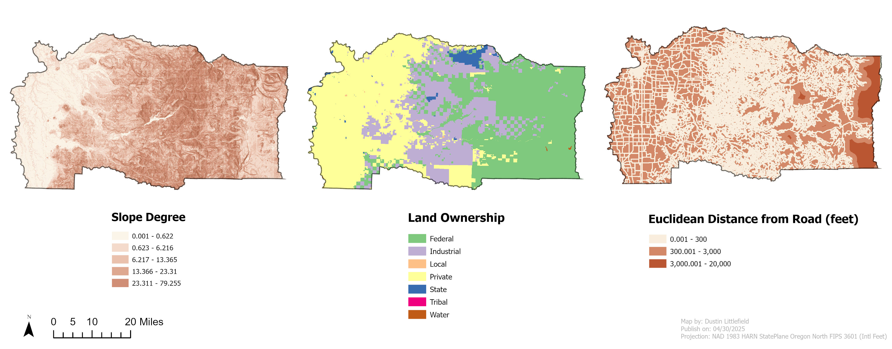

---

### Urban and Transportation Analysis

- **EV Charging Stations and LA Schools – Route Network Analysis**  
  Closest facility routes from schools to nearby electric vehicle charging stations in Los Angeles.
  
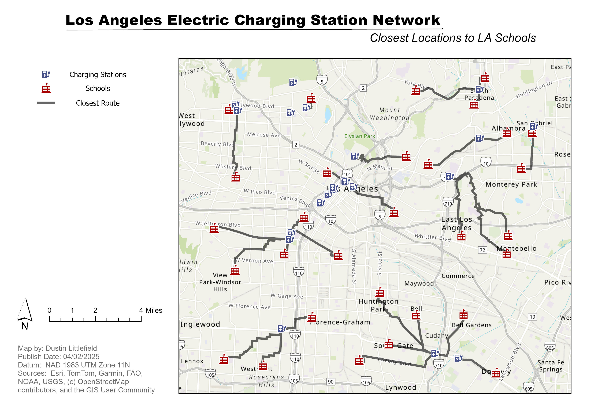

- **Light Rail Population – Census Blocks (Interpolated)**  
  Estimated population served by Phoenix light rail using interpolated block-level census data.
  
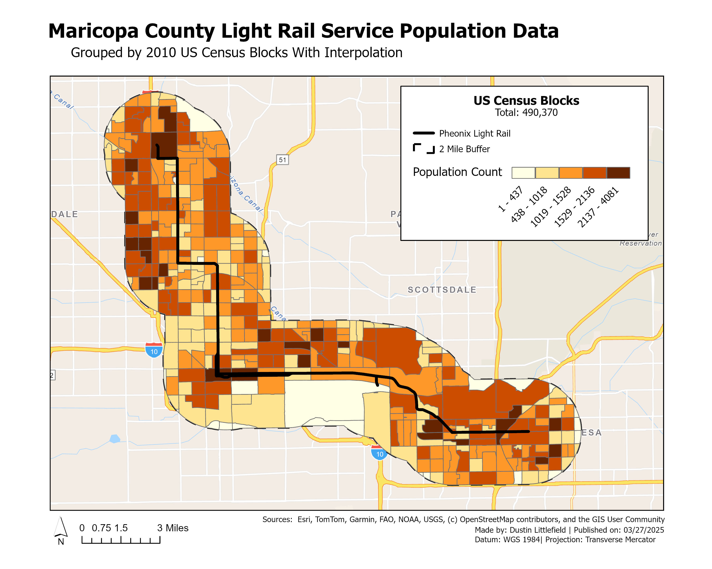

- **Light Rail Population – Census Blocks (No Interpolation)**  
  Same analysis without interpolation, using raw census block boundaries for a comparative view.
  
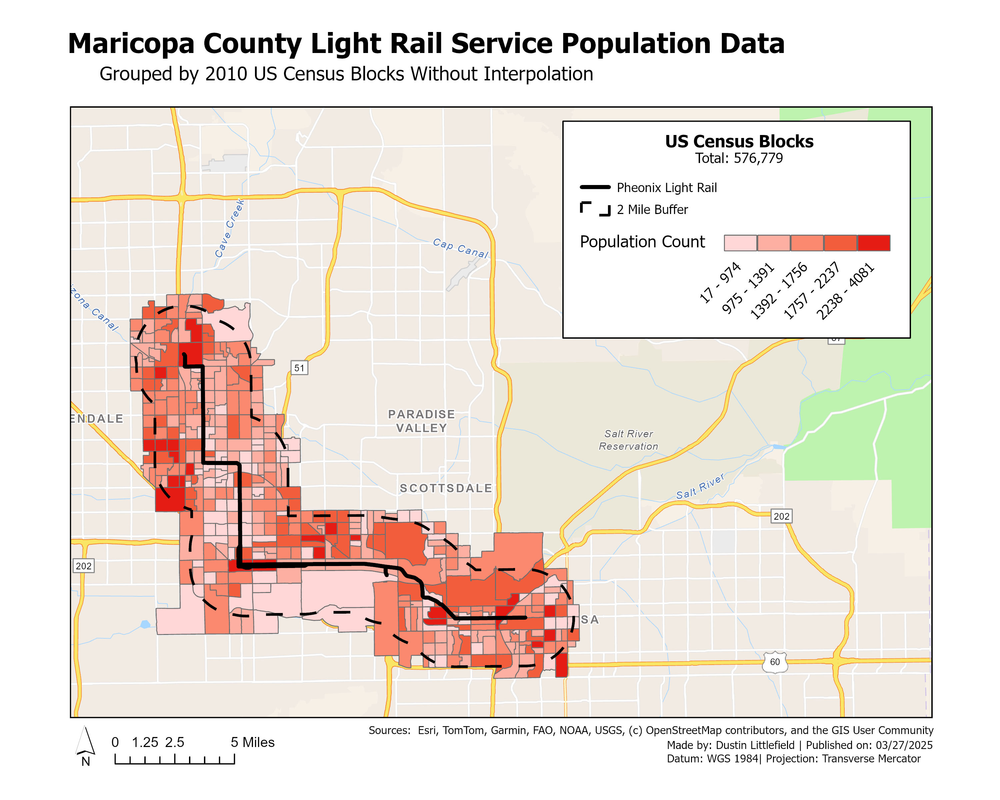

- **North Albany District Expansion Map**  
  Outlines current and proposed municipal boundaries in Albany, Oregon for planning purposes.
  
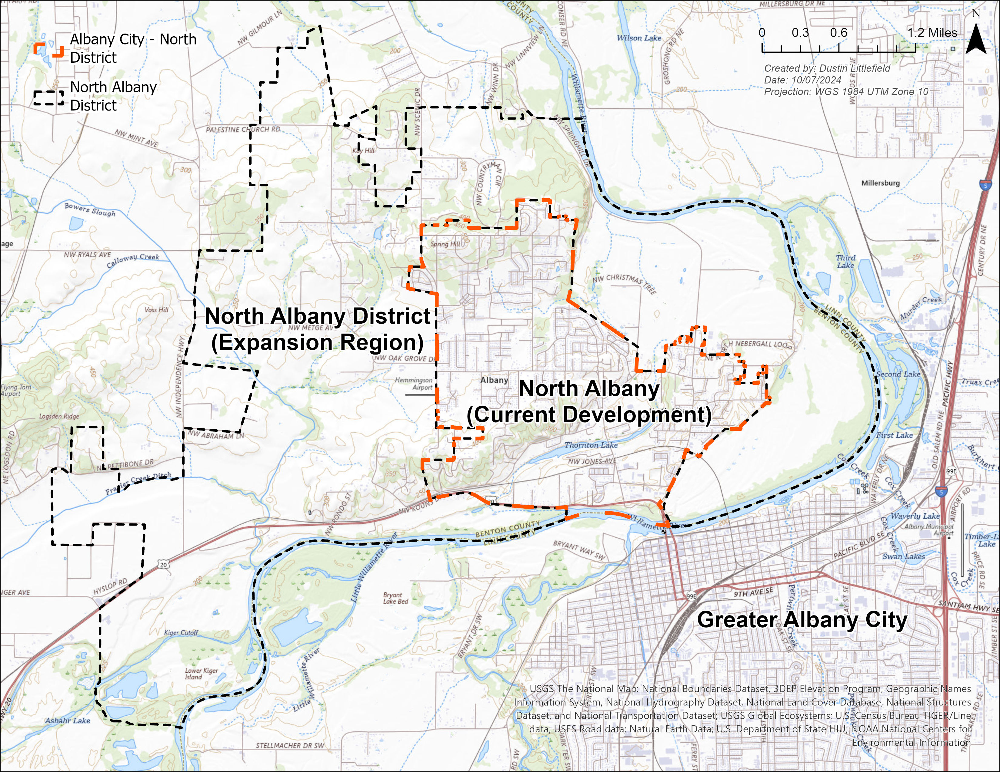

- **Shortest Driving Routes – USC to Dodger Stadium**  
  Compares the shortest-distance route and the fastest-time route between two Los Angeles landmarks using network modeling.
  
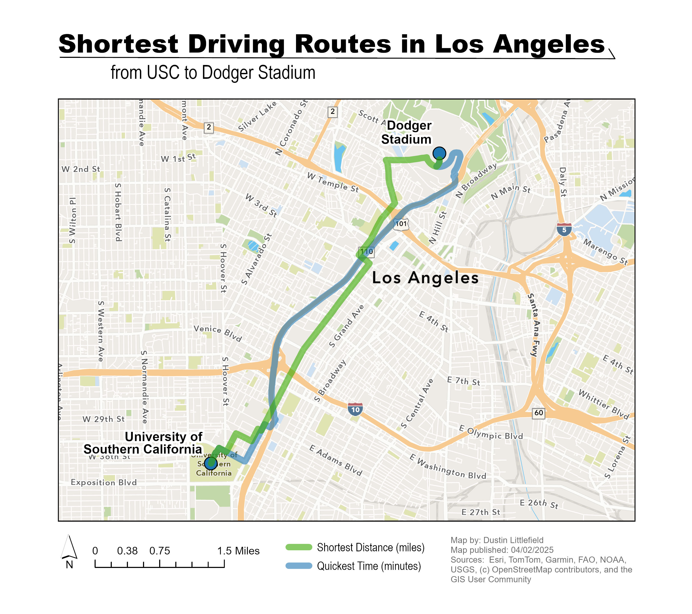

- **Sweet Home Urban Development Concept Map**  
  Conceptual land use and streetscape planning for redevelopment in Sweet Home, Oregon.

---

### Wildlife and Habitat Studies

- **Bald Eagle Habitat Suitability – San Bernardino National Forest**  
  Raster-based suitability analysis using slope, elevation, and proximity to water to classify nesting habitat.
  
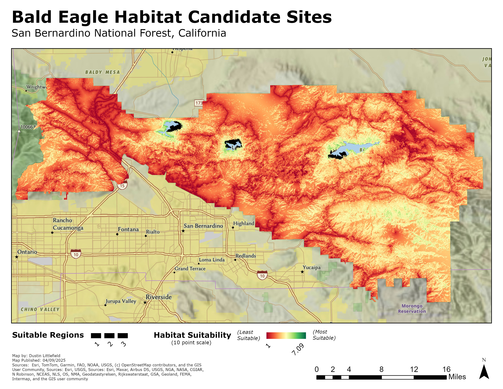

- **Fisher Range – Linkage and Barriers in Oregon**  
  Map of known barriers and priority habitat corridors for the fisher, a sensitive carnivore species.
  

- **Linn County Wildlife Connectivity – ODFW Priority Areas**  
  Visualization of statewide wildlife connectivity zones as defined by the Oregon Department of Fish and Wildlife.
  
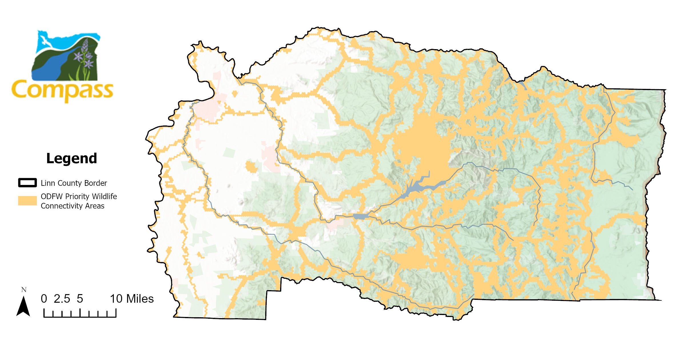

- **Species Linkage Buffers – Oregon**  
  Overlapping buffer zones illustrating connectivity corridors by species group (amphibians, mammals, etc.).
  

- **Wildlife Habitats – Oregon Raster Map**  
  Classified habitat raster showing statewide general wildlife zones.
  

- **Pacific Marten Range – Linkage and Barriers in Oregon**  
  Connectivity and fragmentation analysis with habitat classification and species imagery.
  

- **Wolverine Range – Linkage and Barriers in Oregon**  
  Visualization of natural and manmade barriers affecting wolverine habitat connectivity.
  

---

### Environmental Health and Interpolation

- **CO Emissions Interpolation – Maricopa County**  
  Comparison of IDW, Kriging, and Trend Surface models to visualize annual carbon monoxide levels using spatial interpolation.
  
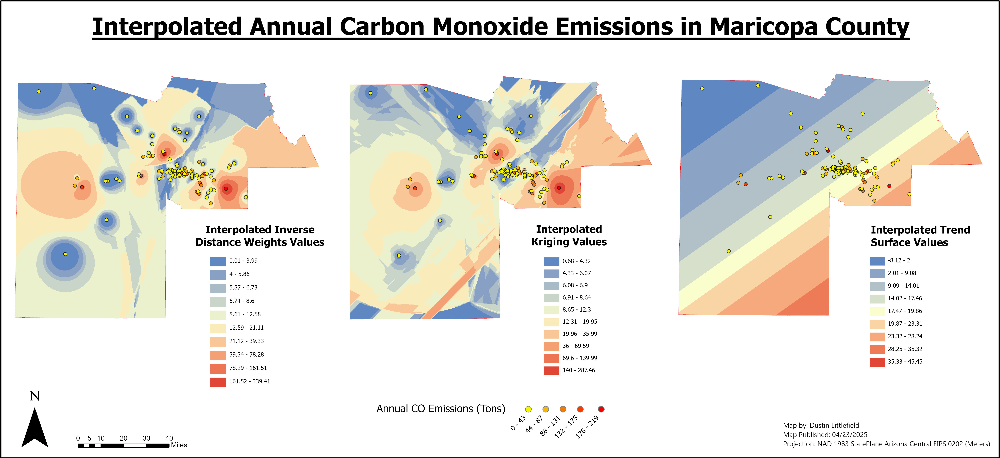

- **COVID-19 Deaths and Healthcare Access – Georgia Counties**  
  A choropleth and proportional symbol map illustrating the spatial relationship between healthcare facility access and COVID-19 mortality.
  

- **Hurricane Frances Path (2004) – Florida Income and Population**  
  Tracks the storm’s path with wind speed zones overlaid on county-level income and population data to highlight areas of vulnerability.
  
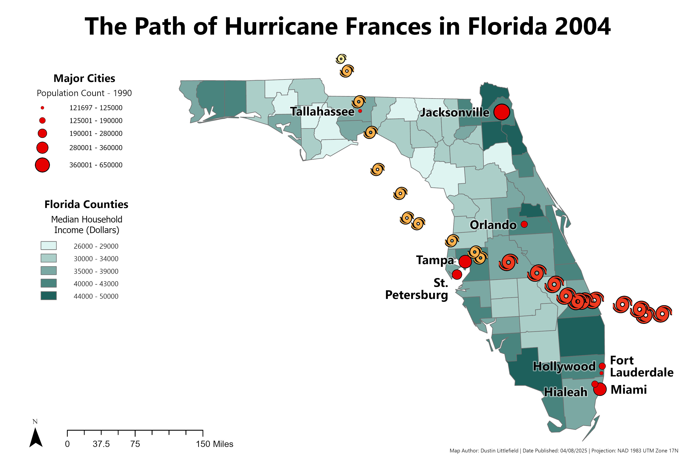

---

### Global Reference

- **Major Cities in Southern and Eastern Asia**  
  General reference map showing capital and major cities over shaded relief terrain and ocean bathymetry.
  
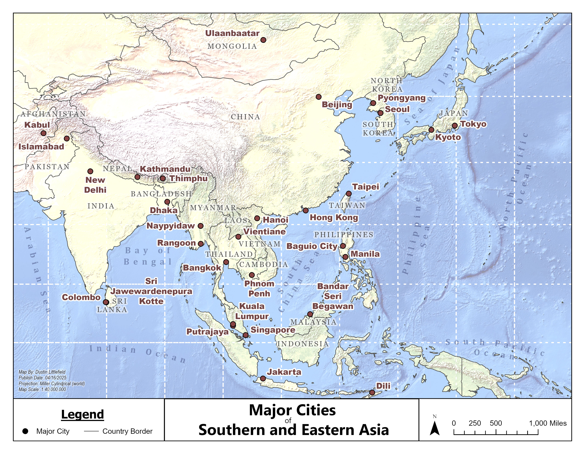

- **Vanilla Production Regions – Mexico and Madagascar**  
  Inset maps highlighting the primary global vanilla-producing regions with surrounding context.
  
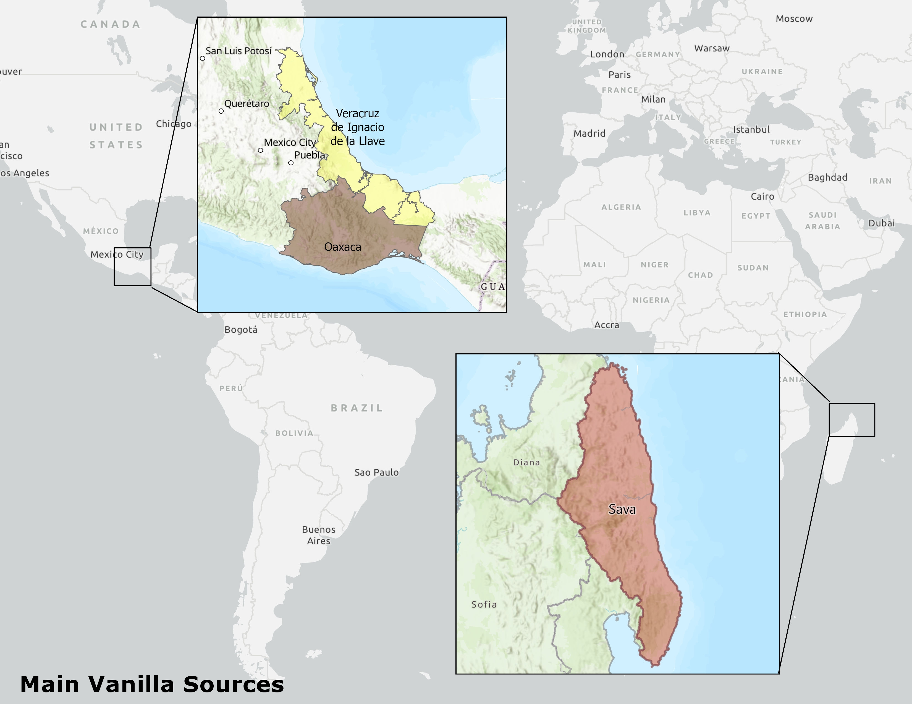

---

## Tools & Techniques Used

- **ArcGIS Pro**
- **QGIS**
- **Python (geopandas, matplotlib, rasterio)**
- **Remote Sensing & DEM analysis**
- **Cartographic Design & Layout Styling**

---

## Contact

**Dustin Littlefield**  
Based in Oregon | 🌐 [LinkedIn](#) www.linkedin.com/in/dustin-littlefield-629803323 
dustinlit@gmail.com

---

## ✅ License

This portfolio is shared for demonstration and educational purposes. Please credit appropriately if reused.

