## About This Portfolio
This portfolio presents a curated selection of cartographic and geospatial analysis work, highlighting thematic mapping, spatial modeling, and data visualization techniques developed through GIS and remote sensing workflows.

- Forestry and land‑use mapping projects  
- Urban development and transportation analyses  
- Wildlife and habitat‑focused studies  
- Environmental health and interpolation work  
- Global reference maps and datasets  
- Story Maps created for coursework and independent projects

## Beachie Creek–Lionshead Complex Fire, Oregon 2020  

**Summary**: A multi‑sensor wildfire assessment using Sentinel‑2 imagery to compute NBR, dNBR, NDVI, and false‑color composites, classify burn severity, and evaluate species‑specific vegetation mortality across the Cascade Range. 

 
<a href="https://dustinlit.github.io/Burn-Severity-and-Vegetation-Mortality-Analysis-of-the-Beachie-Creek-Lionshead-Complex-Fire/" target="_blank">
  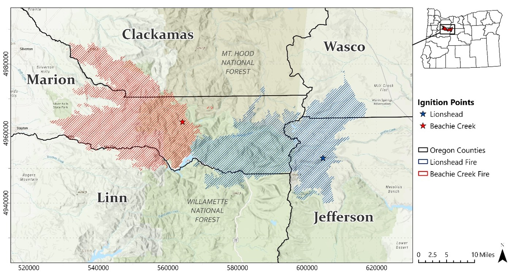
</a>
 

<a href="https://dustinlit.github.io/Burn-Severity-and-Vegetation-Mortality-Analysis-of-the-Beachie-Creek-Lionshead-Complex-Fire/" target="_blank">
  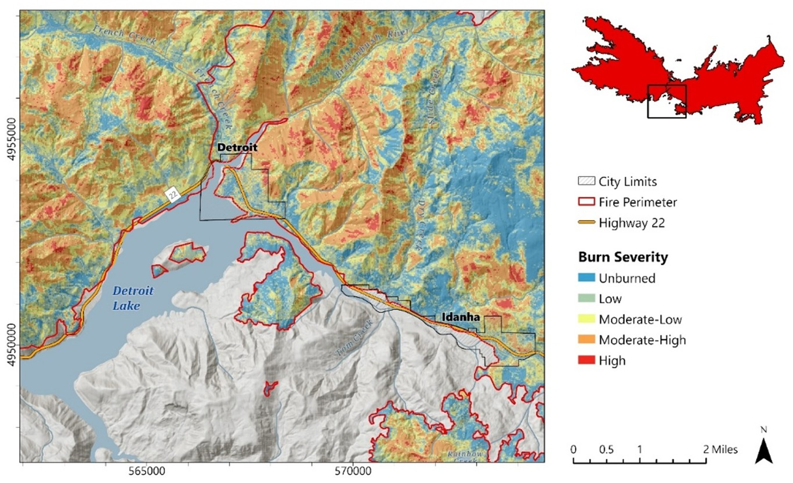
</a>
 

<a href="https://dustinlit.github.io/Burn-Severity-and-Vegetation-Mortality-Analysis-of-the-Beachie-Creek-Lionshead-Complex-Fire/" target="_blank">
  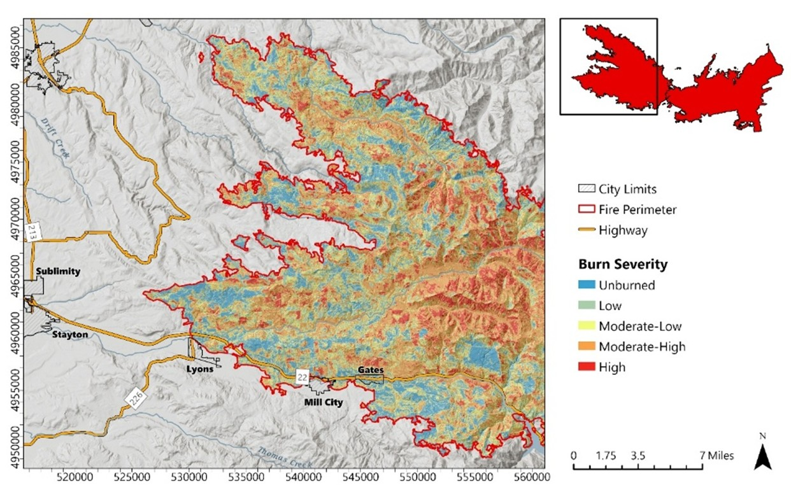
</a>
 

<a href="https://dustinlit.github.io/Burn-Severity-and-Vegetation-Mortality-Analysis-of-the-Beachie-Creek-Lionshead-Complex-Fire/" target="_blank">
  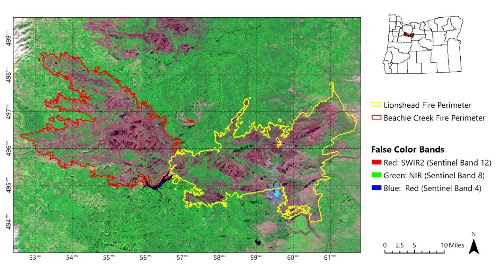
</a>
 

<a href="https://dustinlit.github.io/Burn-Severity-and-Vegetation-Mortality-Analysis-of-the-Beachie-Creek-Lionshead-Complex-Fire/" target="_blank">
  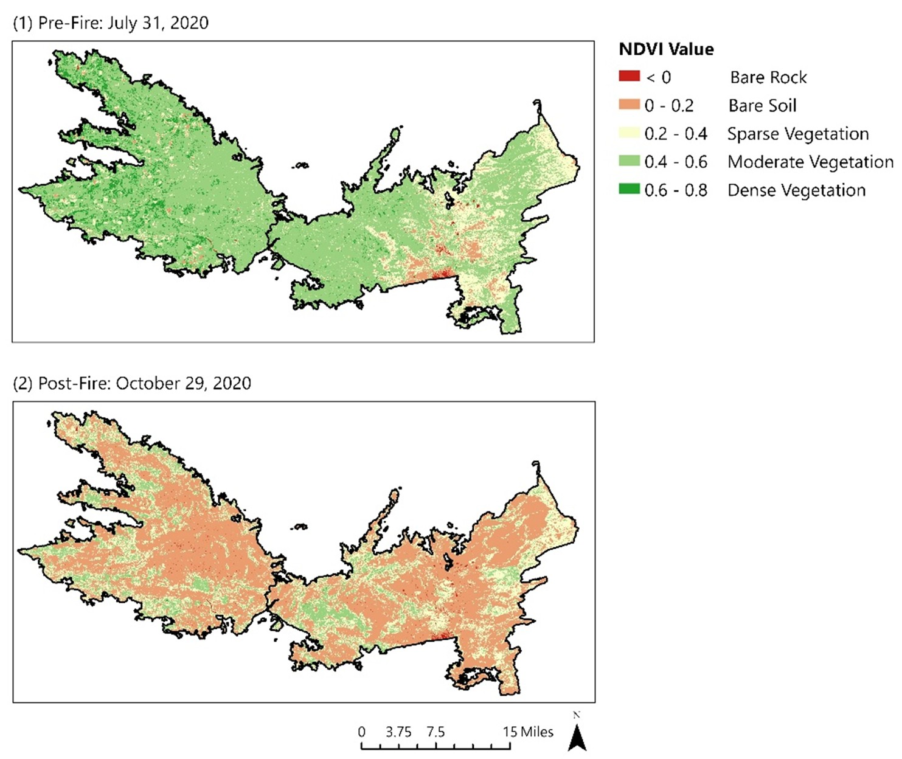
</a>
 
 

## Dixie Fire, California 2021

**Summary:** A Landsat‑8–based burn severity workflow applying NBR/dNBR, pre‑/post‑fire spectral comparison, and USGS severity thresholds to quantify vegetation loss and landscape‑scale fire impacts.  
 

 

<a href="https://dustinlit.github.io/Dixie-Fire-Burn-Severity-Analysis/" target="_blank">
  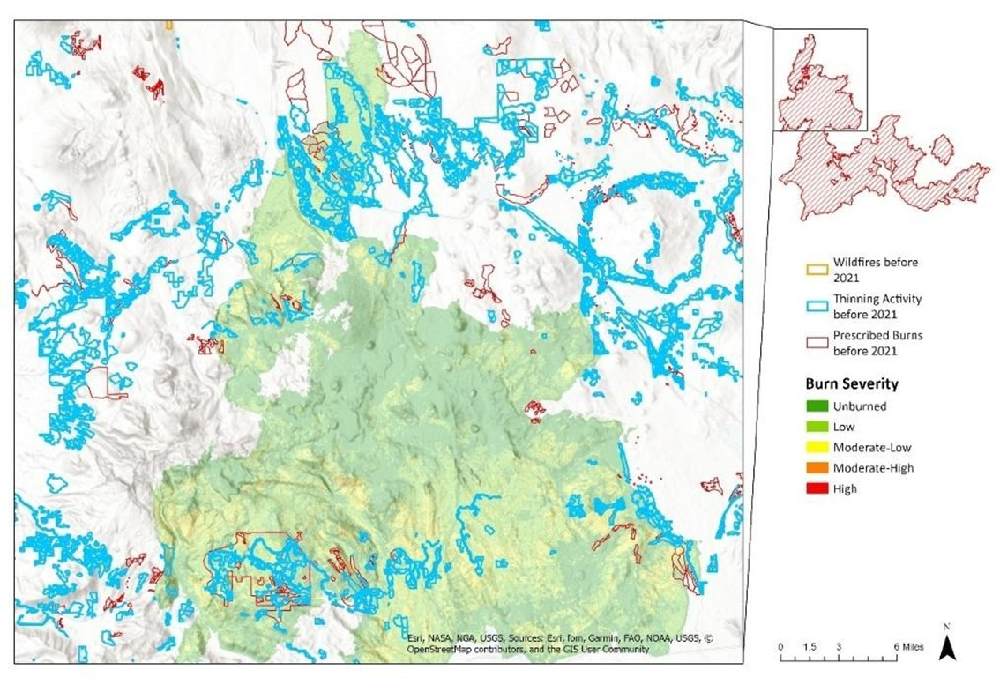
</a>
 

<a href="https://dustinlit.github.io/Dixie-Fire-Burn-Severity-Analysis/" target="_blank">
  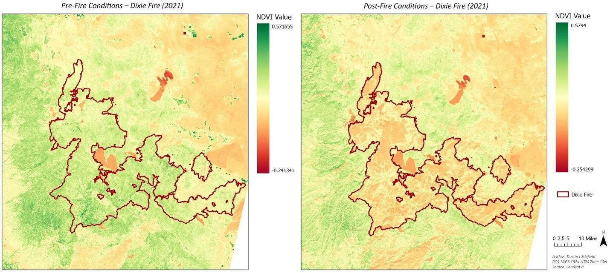
</a>
 
 

## Atlanta Metropolis Region 2000–2020

**Summary:** A two‑decade land‑cover change detection analysis using Landsat imagery, supervised classification, and spatial metrics to map urban growth patterns and quantify development across the Atlanta metropolitan region. 

<a href="https://dustinlit.github.io/Atlanta-Urban-Sprawl-Change-Detection/" target="_blank">
  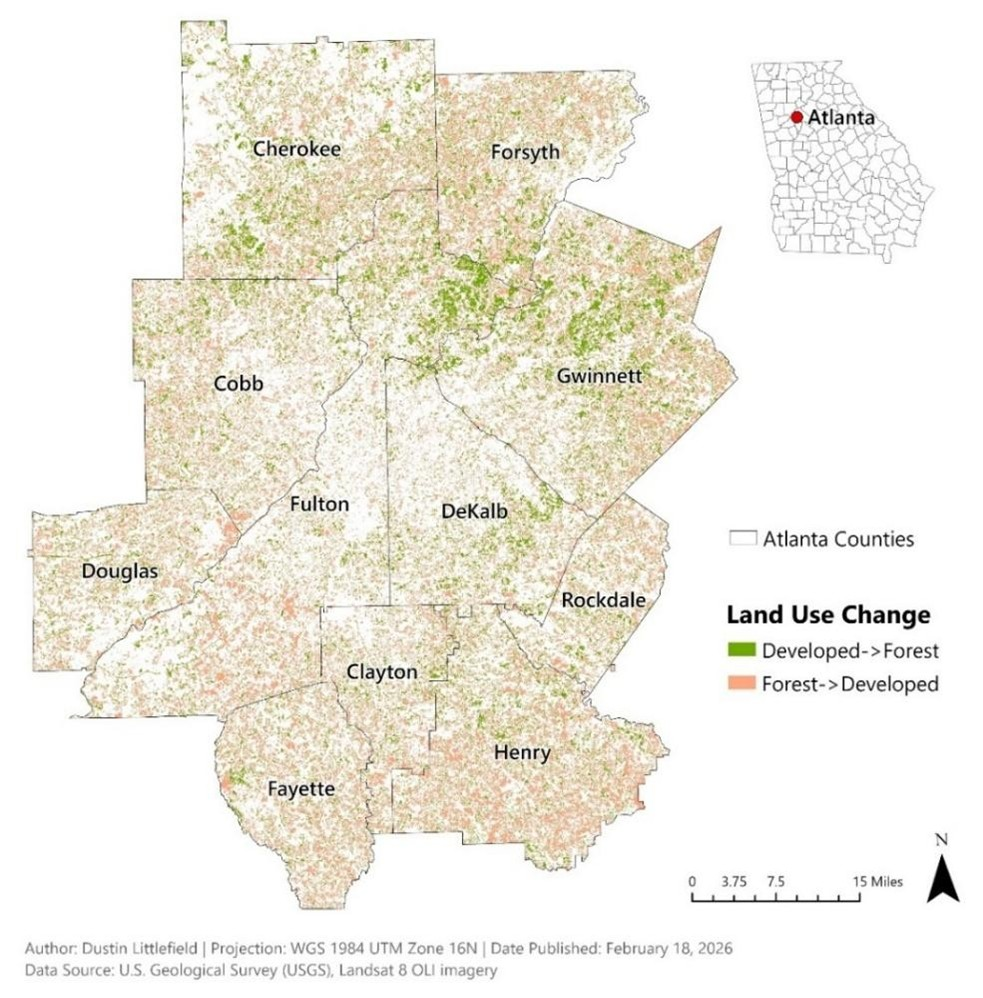
</a>
 

 
 

## Pennsylvania Hydrology 2024

**Summary:** A machine‑learning hydrology project integrating watershed variables, climate predictors, and USGS streamflow records to train and evaluate regression models for short‑term flow forecasting.
 

 

<a href="https://dustinlit.github.io/Pennsylvania-Hydrology-ML-Streamflow-Forecasting/" target="_blank">
  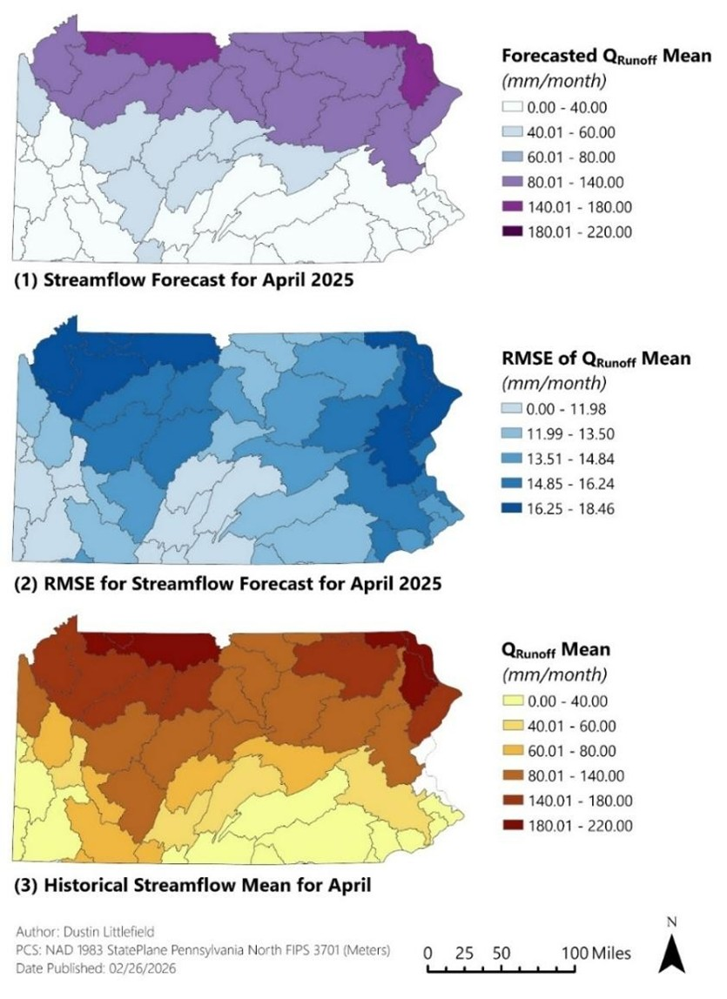
</a>
 

## Story Maps

 

<a href="https://storymaps.arcgis.com/stories/393f3b178f4748e9a6fcaf17c5e4a3f6">
  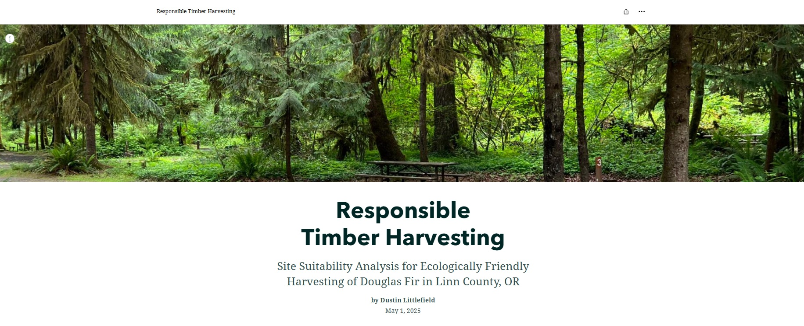
</a>

 
 

<a href="https://storymaps.arcgis.com/stories/aacc9eee41f74294b807306209131ac2">
  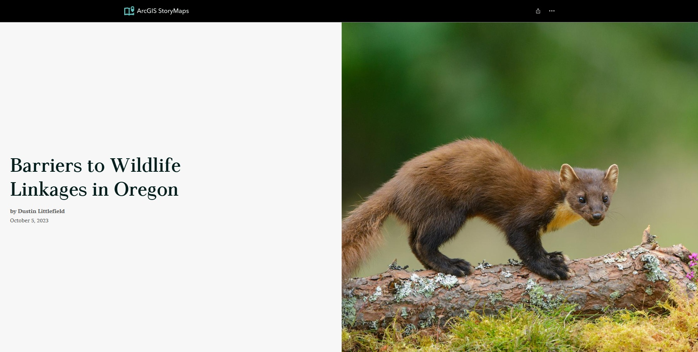
</a>

 

## Tools & Techniques Used

- **ArcGIS Pro**  
- **QGIS**  
- **Python (geopandas, matplotlib, rasterio)**  
- **Remote Sensing & DEM analysis**  
- **Cartographic Design & Layout Styling**

## Contact

**Dustin Littlefield**  
based in Oregon, USA  
[LinkedIn](https://www.linkedin.com/in/dustin-littlefield-629803323)  
**Email:** dustinlit@gmail.com

## License

© 2026 Dustin Littlefield • Environmental Data Science & Remote Sensing